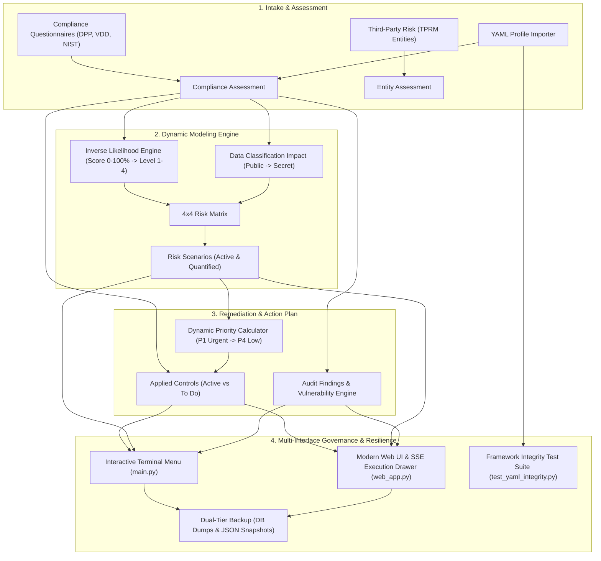

# CISO Assistant Automation & Orchestration Platform
## Comprehensive Feature Guide & Executive Overview

> **Target Audience:** Leadership & Management (CISO, Head of Information Security, VP of Engineering, Audit Directors)  
> **Author:** Romain (`darckcerberus`)  
> **Platform Version:** 2.1 (September 2026)  
> **Test Suite Status:** 162 Tests Passing (100% Green across 13 test suites)

---

## Executive Summary

The **CISO Assistant Automation & Orchestration Platform** is an enterprise-grade Governance, Risk, and Compliance (GRC) automation engine. It bridges the gap between static compliance audits and operational risk management by establishing a **continuous, automated, and mathematically rigorous workflow**:

1. **Intake & Assessment:** Ingests audit questionnaires, third-party vendor reviews, and compliance answers via REST API, YAML application profiles, and library frameworks (DPP, Vendor Due Diligence, NIST CSF 2.0).
2. **Dynamic Risk Derivation:** Automatically calculates **Likelihood** and **Impact** scores from compliance answers, generating risk scenarios across a standardized $4 \times 4$ Risk Matrix.
3. **Remediation & Priority Synchronization:** Dynamically provisions applied security controls and calculates urgent action priorities ($P1$ Urgent to $P4$ Low) directly tied to risk levels.
4. **Vulnerability & Finding Provisioning:** Automatically identifies compliance gaps, generating formal audit findings linked to threats and weaknesses.
5. **Third-Party Risk Management (TPRM):** Full modeling of external suppliers, entity assessments, and representative assignments.
6. **Modern Web UI & Real-Time Orchestration:** Browser-based orchestration console mirroring all CLI features with a live Server-Sent Events (SSE) execution drawer.
7. **Disaster Recovery & Portability:** Dual-tier enterprise backup facilities including server-side database dumps, portable JSON workspace snapshots with SHA-256 cryptographic verification, and one-click restores.
8. **Relational Framework Integrity:** Deep schema, foreign key, scoring logic, and splash-screen validation across all catalog frameworks.



---

## Core Business Value & ROI

| Business Challenge | Traditional / Manual Process | With Our Automation Platform | Business Impact & ROI |
| :--- | :--- | :--- | :--- |
| **Audit-to-Risk Translation** | Weeks of manual spreadsheet mapping between audit questions and risk registers. | **Instant & Automated**: Real-time evaluation of risk scenarios as soon as an audit is answered. | **95% reduction** in risk assessment turnaround time. |
| **Control Prioritization** | Arbitrary or subjective prioritization; teams struggle to know what to fix first. | **Dynamic Risk-Driven Prioritization**: Controls inherit P1–P4 priorities directly from scenario severity. | Engineers focus on highest-impact security gaps first. |
| **Audit Findings & Vulnerabilities** | Gaps manually transcribed into issue trackers; disconnected from risk scenarios. | **Automated Provisioning**: Low-scoring answers automatically spawn formal audit findings linked to CVEs and threats. | Zero missed findings; complete audit traceability. |
| **Third-Party Risk (TPRM)** | Disconnected supplier spreadsheets; slow vendor onboarding reviews. | **Built-in TPRM Entity Assessments**: Criticality, maturity, and trust scoring with automated representative assignments. | Scalable vendor due diligence and compliance visibility. |
| **Multi-Interface Orchestration** | CLI-only tools inaccessible to compliance directors and management. | **Modern Web UI & Live Drawer**: Browser dashboard with real-time SSE execution logs, status cards, and action modals. | Democratized access across technical and non-technical stakeholders. |
| **Disaster Recovery & Migration** | High-risk manual database interventions; risk of data loss. | **Automated Dual-Tier Backups**: One-click database dumps and portable JSON snapshots with SHA-256 integrity hashing. | Enterprise resilience; rapid staging-to-production replication. |
| **Framework Quality Assurance** | Broken foreign keys and invalid question logic silently deployed to production. | **Automated Relational Integrity Engine**: Deep relational schema tests enforcing foreign keys, scoring, and visibility rules. | Zero deployment regressions in framework definitions. |

---

## Detailed Platform Capabilities & Feature Breakdown

### 1. Modern Web UI & Real-Time Orchestration Dashboard
- **Dedicated Web Management Console:** Run standalone via `python3 web_app.py`, CLI flag `python3 main.py --web`, or menu option `10`.
- **Real-Time SSE Execution Drawer:** Asynchronous background tasks stream live terminal logs directly into a responsive drawer in the browser using Server-Sent Events (`/api/stream-task/<task_id>`).
- **Complete Feature Parity with CLI:**
  - Real-time deployment status cards and badges (`CONFIGURED`, `UNANSWERED`, `AUDIT_ONLY`, `NOT_FOUND`).
  - Batch application creation (all reference profiles or individual apps).
  - Interactive unanswered audit demo assignment (`--create-audit`).
  - Dynamic risk and control generation (`--generate-risks`).
  - Cross-application control priority linking (`--link-controls`).
  - Workspace backup creation (JSON snapshots & database dumps) and inspection.
  - Safe application teardown with confirmation safeguards.
- **Configurable Networking:** Custom listening host (`--web-host`), port (`--web-port`), and browser auto-open flag (`--web-open`).

### 2. Dynamic Risk Scenario Engine
- **Inverse Likelihood Modeling:** Compliance maturity directly reduces risk. When an audit question scores 100%, risk likelihood drops to minimum; when score is 0%, likelihood increases to maximum:
  $$\text{scaled\_likelihood} = \min\left(4, \max\left(1, 4 - \left\lfloor\frac{\text{score} - 1}{25}\right\rfloor\right)\right)$$
- **Classification-Driven Impact:** Automatically maps data classification levels (`Public`, `Internal`, `Confidential`, `Secret`) and availability tiers to impact ratings ($1$ to $4$).
- **$4 \times 4$ Risk Matrix Evaluation:** Matches probability and impact against standard risk matrices, calculating current and residual risk levels.
- **Contextual Resource Binding:** Automatically attaches perimeter assets, asset owners, existing controls, and planned controls to each scenario.
- **Stale Scenario Pruning:** Automatically identifies and purges obsolete scenarios when audit answers change or questions are marked not applicable.

### 3. Intelligent Applied Control Management
- **Automated Control Generation:** Instantiates applied controls from reference frameworks for every assessed requirement.
- **State Resolution (`active` vs. `to_do`):**
  - **$100\%$ Score:** Control marked `active` with empty owner list (operational & compliant).
  - **$<100\%$ Score:** Control marked `to_do` and assigned to perimeter owner for remediation.
- **Dynamic Priority Engine:** Applied controls inherit priority from associated risk scenarios:
  - **Critical Risk (Level 4):** $\rightarrow$ **Priority 1 (Urgent)**
  - **High Risk (Level 3):** $\rightarrow$ **Priority 2 (High)**
  - **Medium Risk (Level 2):** $\rightarrow$ **Priority 3 (Medium)**
  - **Low Risk (Level 1):** $\rightarrow$ **Priority 4 (Low)**
- **Asset Relationship Integrity:** Ensures all applied controls are linked to their respective perimeter assets (`ensure_assets_for_control`).
- **Recurrent Controls & Cadence Support:** Schema-level support for recurring control verification cycles (daily, weekly, monthly, quarterly, annually).

### 4. Audit Findings & Vulnerability Provisioning
- **Dedicated Findings Assessments:** Automatically creates and associates `FindingsAssessment` containers for each audit scope.
- **Automated Finding Creation:** Ingests non-compliant requirement answers and produces standardized audit findings with:
  - Finding name, description, and auditor observations.
  - Severity level ($0=\text{info}$ up to $4=\text{critical}$) and remediation priority ($P1-P4$).
  - Bi-directional associations with threats, vulnerabilities, reference controls, and applied controls.
- **Threat & Vulnerability Catalog Management:** Idempotently ensures all library-defined threats and weaknesses are provisioned in CISO Assistant before linking.

### 5. Third-Party Risk Management (TPRM) & Organization Modeling
- **Multi-Tenant Hierarchy:** Full modeling of Domains, Folders, Perimeters, Assets, and External Entities.
- **Automated Asset Management:** Automatically provisions primary assets (`type="PR"`) linked to perimeters and sets CIA security objectives (Confidentiality, Integrity, Availability).
- **TPRM Supplier Scoring:** Captures supplier criticality ($1-4$), cybersecurity maturity ($1-4$), trust level ($1-4$), and qualitative conclusion (`ok`, `warning`, `blocker`).
- **Representative User Management:** Idempotently creates user accounts, assigns roles, and designates entity representatives for external supplier audits.

### 6. Reference Application & Vendor Portfolio (12 Pre-Configured Architectures)
The platform includes 12 ready-to-deploy application and vendor profiles demonstrating diverse compliance postures, data classifications, availability tiers, and risk profiles across frameworks:

#### Multi-level DPP Framework (8 Internal & Cloud Applications)
| # | Application | Data Classification | Compliance Target | Expected Risk | Business Scenario |
| :-: | :--- | :--- | :--- | :--- | :--- |
| **1** | `App-Secure-Core` | **Secret** | 100% Compliant | Low (Acceptable) | Mission-critical vault with full MFA, encryption, and logging. |
| **2** | `App-Vulnerable-Portal` | **Secret** | 0% Non-Compliant | Critical / Urgent | High-value customer portal with unencrypted traffic and missing controls. |
| **3** | `App-Internal-Tool` | **Internal** | Mixed | Medium | Intranet employee portal with LAN-restricted exemptions. |
| **4** | `App-Public-Blog` | **Public** | Low Sensitivity | Low (Capped) | Public marketing content; unauthenticated public origin. |
| **5** | `App-HR-People-System` | **Confidential** | Privacy Gaps | High (Privacy / GDPR) | Employee records with unmasked non-prod retention and deletion gaps. |
| **6** | `App-Customer-Payment-API`| **Secret** | 95% High | Low-Medium (SLA Gap) | PCI-DSS compliant API with vendor breach notification SLA gap monitoring. |
| **7** | `App-Legacy-ERP-Production` | **Internal** | Legacy Gaps | Medium (OT Enclave) | Manufacturing plant ERP with unencrypted database in isolated OT VLAN. |
| **8** | `App-AI-Analytics-Workbench`| **Confidential** | GenAI Gaps | High (Prompt Leakage) | Cloud GenAI analytics using external LLM without zero-retention contract. |

#### Vendor Due Diligence (VDD) Framework (4 Third-Party Supplier Profiles)
| # | Vendor Profile | Data / Availability Tier | Compliance Posture | Expected Residual Risk | TPRM Conclusion & Business Scenario |
| :-: | :--- | :--- | :--- | :--- | :--- |
| **9** | `Vendor-Cloud-CRM` | **Tier 2 Conf. / Tier 2 Avail.** | 100% Compliant | Low (Acceptable) | **`ok`**: ISO 27001/SOC 2 certified CRM SaaS with MFA, KMS encryption, tested BCP/DR, and 48h breach notification SLA. |
| **10** | `Vendor-Shadow-Payroll` | **Tier 1 Secret / Tier 1 Avail.** | 0% Non-Compliant | Critical / Urgent Blocker | **`blocker`**: Mission-critical payroll SaaS handling employee bank details with shared credentials, no pentest, no MFA, and no tenant isolation. |
| **11** | `Vendor-AI-Transcription` | **Tier 2 Conf. / Tier 3 Avail.** | Mixed / GenAI Gaps | High (AI & Supply Chain) | **`warning`**: Meeting audio transcription SaaS with robust web app controls but upstream LLM retention without ZDR and unvetted subcontractors. |
| **12** | `Vendor-Marketing-Widget` | **Tier 4 Public / Tier 4 Avail.** | Mixed / Low Sensitivity | Low / Very Low (Capped) | **`ok`**: Website analytics chat widget; lacks SOC 2 but minimal data sensitivity caps all residual risks at Low or Very Low. |

### 7. Enterprise Backup, Snapshot & Disaster Recovery
- **Dual-Tier Backup Architecture:**
  1. **Server Database Dump:** Downloads and restores raw database dumps via CISO Assistant Serdes API (`/api/serdes/dump-db/` and `/api/serdes/load-backup/`).
  2. **Portable Workspace Snapshot:** Serializes entire workspace configurations (domains, perimeters, assets, compliance audits, controls, risks, findings) into clean, portable JSON files.
- **Cryptographic Integrity:** Computes SHA-256 hashes for all backups to prevent corruption or tampering.
- **Backup Discovery & Inspection:** Built-in tools to list, inspect metadata, examine resource counts, and execute one-click restores.

### 8. Relational Framework Integrity & Automated Schema Testing
- **Framework Catalog Validation (`FRAMEWORK_CATALOG`):** Validates all registered framework definitions (`newDPP.yml`, `vendor-due-diligence.yaml`).
- **Deep Relational Checks:**
  - Global URN uniqueness across frameworks, requirement nodes, questions, choices, risks, threats, vulnerabilities, and controls.
  - Requirement node hierarchy and tree depth consistency.
  - Foreign key cross-referencing between risk scenarios, threats, vulnerabilities, and assessable requirement nodes.
  - Choice scoring consistency (`add_score` vs `compute_result`).
  - Splash-screen standards: validates required introductory instructions and concluding thank-you splash screens.
  - Respondent field visibility: verifies audit compliance score, status, and results remain hidden for respondents.
  - Risk matrix grid dimensions and integer cell validation.

### 9. Operational Safety & Protected User Safeguards
- **Protected Administrator Accounts:** Enforces safeguards in `UserDict` preventing accidental deletion of primary administrative accounts (`admin@ciso.local`).
- **Safe Reverse-Dependency Teardown Ordering:** Ensures deletion operates in strict reverse dependency order:
  $$\text{TPRM Assessments} \longrightarrow \text{Findings} \longrightarrow \text{Risks} \longrightarrow \text{Controls} \longrightarrow \text{Compliance} \longrightarrow \text{Assets} \longrightarrow \text{Perimeters}$$

### 10. Dynamic Centralized Logging System
- **Centralized Configuration:** Configured via `classes/utils.py`, supporting standard levels (`DEBUG`, `INFO`, `WARNING`, `ERROR`, `CRITICAL`).
- **Dynamic Runtime Level Adjustment:** Configurable via CLI flag `--log-level` or programmatically via `utils.set_log_level()`.
- **Comprehensive Logging Documentation:** Full implementation details in `LOGGING_GUIDE.md`.

---

## Quality Assurance & Verification

The platform has been built with strict test-driven discipline:
- **162 Automated Tests Passing:** 100% green execution across 13 dedicated test suites.
- **High-Speed Execution:** Full test suite runs in **~35 seconds** (`python3 -m unittest discover tests`).
- **Test Suite Breakdown:**
  1. `test_answers_import.py`: YAML answer parsing, type coercion, and assessment updates.
  2. `test_application_scenarios.py`: End-to-end scenario simulations and mathematical scoring.
  3. `test_backup.py`: Database dumps, JSON workspace snapshots, SHA-256 hashing, and restore operations.
  4. `test_examples_manager.py`: Application creation, linking, deletion ordering, and status detection.
  5. `test_findings.py`: Audit finding provisioning, severity calculation, and vulnerability linkage.
  6. `test_main_status.py`: ASCII deployment status table rendering, lifecycle evaluation, and column formatting.
  7. `test_risk_calculations.py`: Inverse likelihood and classification impact mathematics.
  8. `test_user_protection.py`: Admin account protection and deletion refusal safeguards.
  9. `test_utils.py`: Centralized logging, level modification, and log filtering.
  10. `test_vulnerability_provisioning.py`: Asset-scoped vulnerability and threat provisioning.
  11. `test_web_ui.py`: Flask routes, asynchronous task runner, SSE log streaming, and REST API dispatch.
  12. `test_yaml_integrity.py`: Framework schema validation, foreign keys, scoring rules, and splash screens.
  13. `test_tasks.py`: Recurrent task template specifications and scheduling.
- **Offline Simulation Mode:** Includes `ApplicationRiskSimulator` allowing instant local evaluation of risk scenarios and priority mappings without live network access.
- **Robust API Resilience:** Session-based HTTP client with exponential backoff retries, JSON pagination caching, non-destructive PATCH operations, and multipart file upload/download streaming.

---

## Live Demonstration Guide (How to Show This to Leadership)

Follow this 6-step demonstration script for executive presentations:

### Step 1: Launch the Modern Web UI Console
```bash
python3 main.py --web --web-open
# or standalone:
python3 web_app.py
```
* **What to highlight:** Open the browser dashboard at `http://127.0.0.1:5000`. Show the clean status badges, application inventory, and the real-time execution drawer with live SSE log streaming.

### Step 2: Show Deployment Status & Health in Terminal
```bash
python3 main.py --status
```
* **What to highlight:** Point out the clean ASCII dashboard displaying all 12 reference applications, their lifecycle states, user assignments, findings counts, risk scenarios, and linked controls.

### Step 3: Interactive Audit Demonstration (Real-World Intake)
```bash
python3 main.py --create-audit App-Demo-Executive --user executive@company.com
```
* **What to highlight:** Show how the system creates the organization structure, perimeter, asset, and assigns the audit to a real user email with 0% answers. Open the CISO Assistant UI to show what a respondent sees.

### Step 4: Trigger Automated Risk & Priority Calculation
```bash
python3 main.py --generate-risks App-Demo-Executive
```
* **What to highlight:** Demonstrate that once questions are answered, the platform automatically evaluates likelihood, impact, creates risk scenarios, provisions applied controls, and sets remediation priorities (P1–P4).

### Step 5: Showcase Disaster Recovery & Resilience
```bash
python3 main.py --backup snapshot
python3 main.py --list-backups
```
* **What to highlight:** Demonstrate that the entire workspace state is exported into an immutable, SHA-256 verified JSON snapshot in seconds.

### Step 6: Verify Test Suite Speed & Stability
```bash
python3 -m unittest discover tests
```
* **What to highlight:** Run all 162 tests in front of your leadership; show 100% green passing across all 13 modules.

---

## Command-Line & Menu Quick Reference

### Interactive Console Menu
Simply run:
```bash
python3 main.py
```
This launches the interactive menu with options 0 through 10:
```
================================================================================
           CISO ASSISTANT - EXAMPLE APPLICATIONS MANAGER
 Target Instance: https://ciso-assistant.siege.red
 Target Folder:   Example Applications
================================================================================
 1) List / Check Status of Examples in CISO Assistant
 2) Create ALL Examples in CISO Assistant (Simulate Answers via API)
 3) Create a Specific Example Application (Simulate Answers via API)
 4) Create Application & Assign Audit to User (Interactive Demo - Unanswered)
 5) Generate Controls & Risk Scenarios for an Application
 6) Remove ALL Examples from CISO Assistant
 7) Remove a Specific Application
 8) Run Offline Simulation (Local Preview without API)
 9) Backup & Restore Management (Dumps, Snapshots, Restores, Listing)
 10) Launch Web UI & REST API Dashboard (http://127.0.0.1:5000)
 0) Exit
================================================================================
```

### Direct CLI Flags
| Command Flag | Description |
| :--- | :--- |
| `python3 main.py --web` | Launch the modern CISO Assistant Web UI and REST API dashboard. |
| `python3 main.py --web-port 8080` | Set custom port for Web UI (default: `5000`). |
| `python3 main.py --web-host 0.0.0.0` | Bind Web UI to custom network interface (default: `127.0.0.1`). |
| `python3 main.py --web-open` | Automatically open default browser when Web UI starts. |
| `python3 main.py --status` | Check real-time deployment status across all applications. |
| `python3 main.py --create all` | Provision all example applications with complete answers and risks. |
| `python3 main.py --create app_secure_core` | Provision a single specific application. |
| `python3 main.py --create-audit <Name> --user <Email>` | Create an unanswered audit demo assigned to a user. |
| `python3 main.py --generate-risks <Name>` | Evaluate risk scenarios and link controls for an application. |
| `python3 main.py --backup [snapshot\|dump]` | Create a portable JSON snapshot or server database dump. |
| `python3 main.py --restore <BackupPath>` | Restore workspace state from a backup file. |
| `python3 main.py --list-backups` | List all discovered backups and SHA-256 checksums. |
| `python3 main.py --link-controls all` | Re-sync control priorities and linkages to risk scenarios. |
| `python3 main.py --remove all -y` | Cleanly tear down all example resources with auto-confirmation. |
| `python3 main.py --offline` | Run offline risk simulator for pre-flight calculation checks. |
| `python3 main.py --log-level INFO` | Set logging verbosity (`DEBUG`, `INFO`, `WARNING`, `ERROR`, `CRITICAL`). |

---

## Architectural File Map

```
ciso-assistant/
├── main.py                             # Main interactive CLI & orchestration entrypoint
├── web_app.py                          # Standalone Web UI application launcher
├── manage_examples.py                  # Quick alias runner for main.py
├── import_entity_assessment_model.py   # YAML department & TPRM entity model importer
├── FEATURES_OVERVIEW.md                # Executive feature guide & leadership presentation document
├── LOGGING_GUIDE.md                    # Centralized logging architecture and level reference
├── web/                                # Modern Web UI Console & REST API
│   ├── app.py                          # Flask application factory, endpoints, and SSE task manager
│   ├── templates/                      # Jinja2 HTML templates
│   │   └── index.html                  # Main Web UI dashboard with execution drawer
│   └── static/                         # Frontend assets
│       ├── css/style.css               # Modern responsive styling and terminal theme
│       └── js/app.js                   # Client controller and EventSource SSE handler
├── classes/                            # Modular domain and API abstractions
│   ├── utils.py                        # REST client, pagination, file transfer, retry engine, logging
│   ├── examples_manager.py             # Application lifecycle, linking, and simulation manager
│   ├── audits/                         # Audit and compliance assessment domain models
│   │   ├── compliance.py               # Compliance assessments & scoring logic
│   │   ├── finding.py                  # Audit findings & assessment container models
│   │   ├── entity_assessment.py        # TPRM external entity assessments
│   │   ├── requirement_assessment.py   # Question-level answer parsing & scoring
│   │   └── requirement_assignment.py   # Owner requirement assignment logic
│   ├── controls/                       # Security controls domain models
│   │   ├── applied.py                  # Applied controls & dynamic P1-P4 priority engine
│   │   └── reference.py                # Reference control definitions
│   ├── core/                           # Core GRC framework, risk, user, and task models
│   │   ├── risk.py                     # Risk assessments, 4x4 matrix, scenarios, vulnerabilities
│   │   ├── framework.py                # Framework library models & YAML loader
│   │   ├── user.py                     # User management & admin account protection safeguards
│   │   └── task.py                     # Task nodes and task template management
│   ├── organization/                   # Organizational hierarchy models
│   │   ├── asset.py                    # Primary assets & CIA security objectives
│   │   ├── perimeter.py                # Security perimeters
│   │   ├── entity.py                   # TPRM external entities & representatives
│   │   └── domain.py                   # Business domains & criticality mapping
│   └── integrations/                   # Integration, serialization, and import adapters
│       ├── backup.py                   # Dual-tier backup (dumps & JSON snapshots)
│       ├── answers_import.py           # YAML answer parsing & normalization logic
│       └── entity_model_import.py      # Department & supplier model importer
├── tests/                              # 162 Unit & Integration Tests (100% green)
│   ├── test_answers_import.py          # YAML answer importer tests
│   ├── test_application_scenarios.py   # End-to-end scenario simulations & risk math
│   ├── test_backup.py                  # Backup creation, hashing, & restore tests
│   ├── test_examples_manager.py        # Lifecycle management & reverse deletion ordering tests
│   ├── test_findings.py                # Finding & vulnerability provisioning tests
│   ├── test_main_status.py             # Status ASCII table rendering & lifecycle tests
│   ├── test_risk_calculations.py       # Inverse likelihood & impact math tests
│   ├── test_tasks.py                   # Recurrent task template tests
│   ├── test_user_protection.py         # Admin user deletion protection tests
│   ├── test_utils.py                   # Centralized logging & level configuration tests
│   ├── test_vulnerability_provisioning.py # Vulnerability & threat provisioning tests
│   ├── test_web_ui.py                  # Web UI, REST API, & SSE log streaming tests
│   └── test_yaml_integrity.py          # Framework YAML syntax, foreign keys, & scoring tests
└── YML/                                # GRC Frameworks & Schemas
    ├── newDPP.yml                      # Multi-level DPP Framework
    ├── nist-cst-2.0.yaml               # NIST Cybersecurity Framework 2.0
    ├── vendor-due-diligence.yaml       # Vendor Due Diligence Framework (12 domains, 80 reqs)
    ├── vendor-due-diligence.md         # Comprehensive VDD framework specification
    └── sample_entity_assessment_model.yml # Organization & TPRM entity model
```

---
*Generated for leadership presentation. All features are fully implemented, verified, and ready for demonstration.*
