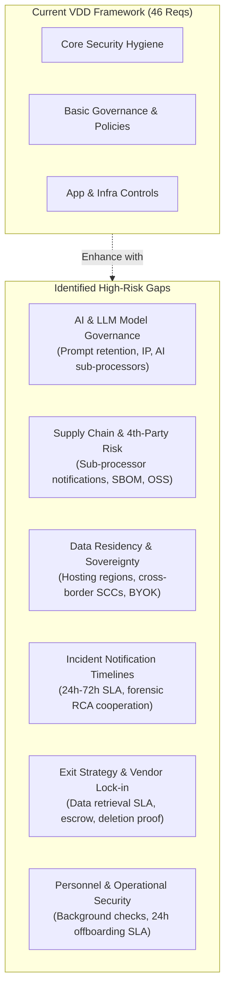
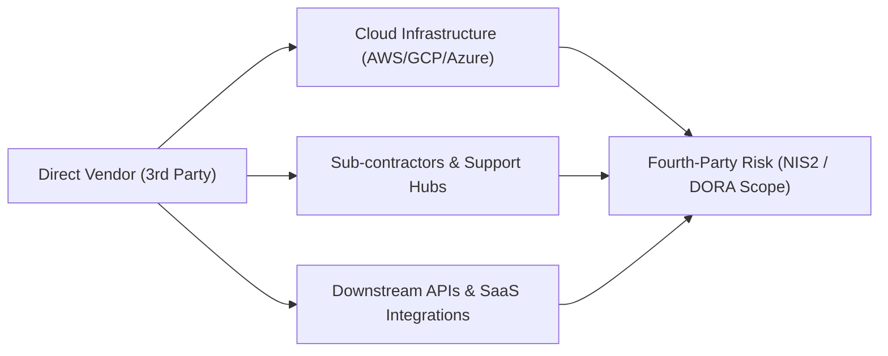
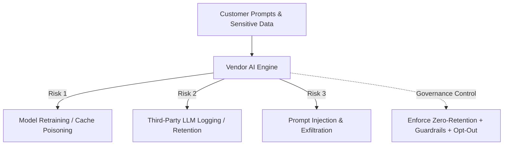

# Vendor Due Diligence (VDD) - Framework Enhancement & Missing Requirements Suggestions

## 1. Executive Summary & Context

The [`YML/vendor-due-diligence.yaml`](vendor-due-diligence.yaml) framework provides a baseline for rapid third-party cybersecurity due diligence, structured into **9 domain categories** and **46 assessable requirements**:

| Domain | Focus Area | Current Req Count | Coverage Strengths |
| :--- | :--- | :---: | :--- |
| **`GOV`** | Governance and organization | 8 | ISO/SOC certifications, CISO designation, policies, GDPR, cyber insurance. |
| **`IAM`** | Access and identity management | 5 | MFA for sensitive ops, privileged access, logging, periodic reviews. |
| **`INF`** | Physical and infrastructure security | 4 | Physical security, WAF/DDoS, anti-malware, log collection. |
| **`SDLC`**| Development security | 7 | SDLC security, vulnerability scanning, updates, prod/test separation, AI training restrictions. |
| **`AUD`** | Audit, testing and assurance | 3 | Audit rights, penetration testing, QA testing. |
| **`INC`** | Incident management | 2 | Incident response plan (IRP), customer notification. |
| **`BAK`** | Business continuity | 6 | Backups, encryption, restore testing, RTO/RPO, BCP/DRP documentation. |
| **`DATA`**| Data management and lifecycle | 3 | Data destruction, portability, multi-tenant isolation. |
| **`APP`** | Application security | 8 | SSO, local MFA, encryption at rest/transit, RBAC, audit logging, password rules. |
| **Total**| **9 Categories** | **46** | **Core baseline security hygiene.** |

---

## 2. Key Industry & Regulatory Gaps Identified

While the current framework is effective for basic profiling, enterprise procurement and security teams operating under modern compliance frameworks (such as **NIS2**, **DORA**, **ISO/IEC 27001:2022**, **GDPR**, and the **EU AI Act**) frequently identify several critical blind spots:

---

## 3. Detailed Suggested Additions

We recommend **28 new requirements**, split into:
1. **Part 1**: 16 enhancements to existing categories (`GOV`, `IAM`, `INF`, `SDLC`, `AUD`, `INC`, `DATA`, `APP`).
2. **Part 2**: 12 requirements across 3 high-impact modern categories (`SCM` - Supply Chain, `AI` - AI Governance, `EXIT` - Exit Management & SLA).

---

### Part 1: Enhancements to Existing Categories

#### Domain: `GOV` (Governance & Personnel Security)

* **`GOV.09` - Pre-Employment Background Verification**
  * **Requirement:** Pre-employment screening and criminal/credential background verification are conducted for all personnel and contractors with logical access to customer data or production environments (subject to applicable local labor laws).
  * **Rationale:** Reduces insider threat risk; mandatory requirement in SOC 2 Type II (CC2.1) and ISO 27001:2022 (Control 6.1).
  * **Evidence:** Written HR screening policy and anonymized audit sample.

* **`GOV.10` - Offboarding and Immediate Deprovisioning SLA**
  * **Requirement:** A documented offboarding process ensures that all logical and physical access is permanently revoked within 24 hours of employee or contractor departure or role reassignment.
  * **Rationale:** Orphaned accounts of terminated employees are one of the most common initial access vectors for threat actors.
  * **Evidence:** Identity provider (IdP) deprovisioning audit logs correlated with HR departure dates.

* **`GOV.11` - Phishing Simulations & Role-Based Training**
  * **Requirement:** Regular phishing simulation exercises and specialized security training (e.g., secure coding for engineers, social engineering defense for executives/support) are conducted at least semi-annually.
  * **Rationale:** Standard awareness is already covered in `GOV.05`; modern frameworks require measurable phishing resilience testing.
  * **Evidence:** Simulation reporting metrics and failure remediation retraining records.

---

#### Domain: `IAM` (Identity & Access Management)

* **`IAM.06` - Endpoint Security & Mobile Device Management (MDM)**
  * **Requirement:** All workstations and mobile devices used by vendor personnel to access customer data or production environments are centrally managed via Mobile Device Management (MDM), with enforced full-disk encryption, automated screen lock, and active EDR agents.
  * **Rationale:** Remote work and BYOD endpoints represent major attack vectors into SaaS environments.
  * **Evidence:** Fleet MDM compliance reports and disk encryption status dashboards.

* **`IAM.07` - Machine Identity & Secret Lifecycle Management**
  * **Requirement:** Non-human identities (API keys, service accounts, certificates, secrets) are inventoried, adhere to least-privilege principles, and are stored in centralized key vaults with scheduled automated rotation.
  * **Rationale:** Hardcoded tokens and non-expiring service keys are heavily targeted in cloud credential stuffing and repository leaks.
  * **Evidence:** Key vault architecture diagram and secret rotation policy.

---

#### Domain: `INF` (Physical & Infrastructure Security)

* **`INF.05` - Certified Storage Media Sanitization & Disposal**
  * **Requirement:** Decommissioned physical servers, hard drives, and magnetic media containing customer data undergo certified cryptographic erasure or physical destruction adhering to NIST SP 800-88 Rev 1 before disposal or reuse.
  * **Rationale:** Guarantees data cannot be recovered from retired datacenter hardware.
  * **Evidence:** Certificates of destruction from certified e-waste sanitization vendors.

* **`INF.06` - Severity-Based Vulnerability Remediation SLAs**
  * **Requirement:** The organization enforces binding remediation SLAs for discovered vulnerabilities based on severity (e.g., Critical vulnerabilities resolved within 14 days, High within 30 days, Medium within 90 days).
  * **Rationale:** While `SDLC.02` mentions scanning, scanning without enforceable patching timelines leaves vulnerabilities open indefinitely.
  * **Evidence:** Historical vulnerability aging reports and patch management policy.

---

#### Domain: `SDLC` (Software Development Lifecycle)

* **`SDLC.08` - Software Bill of Materials (SBOM) & Open-Source Governance**
  * **Requirement:** An automated Software Bill of Materials (SBOM) is generated and maintained to track all third-party libraries, container images, and open-source components for known vulnerabilities (CVEs) and license compliance.
  * **Rationale:** Essential for supply chain integrity (NIST SP 800-161, US Executive Order 14028, EU Cyber Resilience Act).
  * **Evidence:** CycloneDX or SPDX formatted SBOM files and SCA pipeline integration.

* **`SDLC.09` - Vulnerability Disclosure Program (VDP) & Bug Bounty**
  * **Requirement:** The vendor maintains a publicly documented security vulnerability disclosure policy (e.g., `security.txt`) and secure intake channel allowing ethical security researchers to report vulnerabilities responsibly.
  * **Rationale:** Industry best practice (ISO 29147); accelerates discovery of zero-days before malicious exploitation.
  * **Evidence:** Public URL to vulnerability disclosure policy or bug bounty platform profile.

---

#### Domain: `AUD` (Audit, Testing & Assurance)

* **`AUD.04` - Regular Third-Party Attestation Availability**
  * **Requirement:** Annual independent audit reports (such as SOC 2 Type II, ISO/IEC 27001 audit summaries, or PCI-DSS Attestation of Compliance) are made available to clients under NDA with bridge/gap letters covering interim periods.
  * **Rationale:** Enables clients to perform continuous vendor monitoring without requiring costly on-site audits.
  * **Evidence:** Latest SOC 2 Type II report with unqualified opinion and current bridge letter.

---

#### Domain: `INC` (Incident Management)

* **`INC.03` - Explicit Breach Notification Timeframe (24h-72h)**
  * **Requirement:** The vendor contractually commits to notifying affected clients in writing without undue delay, and in no event later than 48 to 72 hours, after confirming or reasonably suspecting a security incident affecting customer data.
  * **Rationale:** Directly aligns with regulatory reporting mandates (GDPR Article 33, NIS2 Article 23, SEC disclosure rules, DORA Article 19).
  * **Evidence:** Master Service Agreement (MSA) / Data Processing Agreement (DPA) notification clause.

* **`INC.04` - Forensic Cooperation and Root-Cause Analysis (RCA)**
  * **Requirement:** In the event of a security incident impacting customer data, the vendor provides a comprehensive Root Cause Analysis (RCA), indicators of compromise (IoCs), and cooperates with the client's internal and external forensic investigators.
  * **Rationale:** Clients cannot fulfill their legal notification duties without forensic telemetry and root-cause details from the vendor.
  * **Evidence:** Incident communication guidelines and sample post-mortem RCA report template.

---

#### Domain: `DATA` (Data Management & Sovereignty)

* **`DATA.04` - Data Residency & Geolocation Transparency**
  * **Requirement:** The vendor clearly defines, documents, and contractually guarantees the geographic regions, countries, and legal jurisdictions where customer primary data, replicas, and backups are hosted and processed.
  * **Rationale:** Essential for regulatory sovereignty (EU GDPR Schrems II, Swiss FADP, HIPAA, Saudi PDPL).
  * **Evidence:** DPA technical schedule listing primary and backup datacenter locations.

* **`DATA.05` - Cross-Border Data Transfer Safeguards**
  * **Requirement:** All international and cross-border transfers of customer data rely on legally validated transfer mechanisms, including current Standard Contractual Clauses (SCCs), Binding Corporate Rules (BCRs), or the EU-US Data Privacy Framework, supported by documented Transfer Impact Assessments (TIAs).
  * **Rationale:** Prevents unlawful international surveillance exposure and GDPR transfer penalties.
  * **Evidence:** Executed SCCs and documented Transfer Impact Assessment.

* **`DATA.06` - Customer-Managed Keys (BYOK / HYOK)**
  * **Requirement:** The application architecture supports tenant-isolated encryption keys or Customer-Managed Keys (Bring Your Own Key - BYOK) integrated with enterprise cloud Key Management Services (e.g., AWS KMS, Azure Key Vault, Google Cloud KMS).
  * **Rationale:** Prevents unauthorized vendor insider access and unilateral government subpoenas.
  * **Evidence:** Architecture specification for customer key isolation and KMS integration guide.

---

#### Domain: `APP` (Application Security)

* **`APP.09` - Automated Session Timeout & Inactivity Lock**
  * **Requirement:** Application user and administrative sessions automatically terminate or require re-authentication after a configurable period of inactivity (defaulting to 15-30 minutes).
  * **Rationale:** Mitigates session hijacking on shared or unattended user workstations.
  * **Evidence:** Application security settings documentation and session management configuration screenshot.

* **`APP.10` - API Security, Rate Limiting & Abuse Prevention**
  * **Requirement:** All public, integration, and tenant APIs implement strict rate limiting, payload size restrictions, schema validation, and protection mechanisms against automated scraping and credential stuffing (OWASP API Security Top 10).
  * **Rationale:** Protects against DoS, inventory depletion, brute force, and data exfiltration.
  * **Evidence:** API gateway configuration and WAF/rate-limiting policy definition.

---

### Part 2: High-Impact New Categories

We recommend introducing **3 new categories** that address supply chain opacity, artificial intelligence risks, and vendor lock-in.

---

#### New Domain: `SCM` - Supply Chain & Sub-processor Management

* **`SCM` (Depth 1 Node)**: Name: `Supply chain and sub-processor management`
* **`SCM.01` - Comprehensive Sub-processor Inventory:** The vendor maintains and publishes an accurate, up-to-date registry of all third-party sub-processors, cloud hosting providers, and external services processing customer data.
* **`SCM.02` - Advance Written Notice of Sub-processor Changes:** The vendor provides at least 30 days prior written notice before onboarding or substituting sub-processors, granting clients the contractual right to object or terminate without penalty.
* **`SCM.03` - Tier-2 / Sub-processor Due Diligence:** The vendor conducts formal, documented security and compliance assessments of all sub-processors prior to onboarding and on an annual basis thereafter.
* **`SCM.04` - Sub-contractor Flow-Down Obligations:** Equivalent data protection, confidentiality, auditability, and incident reporting obligations are legally bound to all downstream sub-processors.

---

#### New Domain: `AI` - Artificial Intelligence & Model Governance

* **`AI` (Depth 1 Node)**: Name: `Artificial intelligence and model governance`
* **`AI.01` - AI Model Inventory & Disclosure:** The vendor explicitly discloses all integrated Generative AI, machine learning models, and third-party foundation model APIs used within the solution.
* **`AI.02` - Zero Data Retention (ZDR) Commitments:** For third-party LLM providers (e.g., Azure OpenAI, Anthropic, Bedrock), the vendor enforces contractual zero-data-retention (ZDR) agreements preventing prompt persistence or external logging.
* **`AI.03` - Absolute Exclusion from Model Training:** Customer inputs, prompts, uploaded documents, embeddings, and generated outputs are contractually prohibited from being used to train, retrain, fine-tune, or benchmark any AI models.
* **`AI.04` - AI Safety Filters & Prompt Injection Guardrails:** The platform employs active guardrails, input/output sanitization, and heuristic safety filters to mitigate prompt injection, jailbreaks, training data extraction, and hallucinated security instructions.

---

#### New Domain: `EXIT` - Service Level Agreements & Exit Management

* **`EXIT` (Depth 1 Node)**: Name: `Service level agreements and exit management`
* **`EXIT.01` - Availability SLA & Service Credit Remedies:** The vendor guarantees a defined monthly service uptime (e.g., $\ge 99.9\%$), publishes real-time system status and incident history, and offers contractual service credits for unmet commitments.
* **`EXIT.02` - Post-Termination Data Portability & Transition:** Upon contract termination, the vendor provides comprehensive data export capabilities in non-proprietary, documented formats (e.g., JSON, CSV, SQL dump) along with technical transition assistance.
* **`EXIT.03` - Written Certification of Data Sanitization:** Within 30 to 60 days of contract termination, the vendor provides formal written certification that all customer data and associated backups have been irrevocably deleted.
* **`EXIT.04` - Software Escrow Agreement:** For critical or bespoke applications, the vendor maintains a software escrow agreement with a recognized escrow agent, releasing source code and build documentation in the event of vendor insolvency, bankruptcy, or discontinuation.

---

## 4. Summary Table of All 28 Proposed Additions

| Ref ID | Title / Focus | Parent Category | Benchmark Alignment |
| :--- | :--- | :---: | :--- |
| **`GOV.09`** | Personnel Background Checks | `GOV` | ISO 27001 Control 6.1, SOC 2 CC2.1 |
| **`GOV.10`** | Immediate Offboarding Deprovisioning SLA | `GOV` | ISO 27001 Control 6.5, CIS Control 5.3 |
| **`GOV.11`** | Phishing Simulations & Specialized Training | `GOV` | NIST CSF PR.AT-01, CIS Control 14.2 |
| **`IAM.06`** | MDM, Endpoint Encryption & EDR | `IAM` | CIS Control 4.1, ISO 27001 Control 8.1 |
| **`IAM.07`** | Machine Identity & Secrets Lifecycle | `IAM` | OWASP Top 10, CIS Control 5.4 |
| **`INF.05`** | Certified Storage Media Sanitization (NIST 800-88) | `INF` | NIST SP 800-88, ISO 27001 Control 8.10 |
| **`INF.06`** | Severity-Based Vulnerability Remediation SLAs | `INF` | PCI-DSS Req 6.3, DORA Article 10 |
| **`SDLC.08`** | Software Bill of Materials (SBOM) & OSS Scan | `SDLC` | NIST SP 800-161, EU Cyber Resilience Act |
| **`SDLC.09`** | Vulnerability Disclosure Program (`security.txt`) | `SDLC` | ISO 29147, RFC 9116 |
| **`AUD.04`** | Annual SOC 2 / ISO 27001 Third-Party Reports | `AUD` | AICPA SOC 2, EBA Outsourcing |
| **`INC.03`** | Breach Notification Timeframe (24h–72h SLA) | `INC` | GDPR Art 33, NIS2 Art 23, DORA Art 19 |
| **`INC.04`** | Forensic Telemetry & Root Cause Analysis (RCA) | `INC` | NIST SP 800-61, ISO 27001 Control 5.28 |
| **`DATA.04`** | Data Residency & Geolocation Guarantees | `DATA` | GDPR Schrems II, Swiss FADP |
| **`DATA.05`** | Cross-Border Transfer Mechanisms (SCCs / TIA) | `DATA` | GDPR Chapter V, EU-US DPF |
| **`DATA.06`** | Customer-Managed Encryption Keys (BYOK / HYOK) | `DATA` | CSA CAIQ v4 CRY-03 |
| **`APP.09`** | Inactivity Lock & Session Timeout Enforcement | `APP` | OWASP ASVS V3, PCI-DSS Req 8.2 |
| **`APP.10`** | API Gateway Security, Rate Limiting & WAF | `APP` | OWASP API Security Top 10 |
| **`SCM.01`** | Public / Up-to-Date Sub-processor Registry | **`SCM`** *(New)* | GDPR Art 28, DORA Article 28 |
| **`SCM.02`** | 30-Day Prior Notice & Right to Object | **`SCM`** *(New)* | Standard Contractual Clauses (Clause 9) |
| **`SCM.03`** | Annual Vendor Due Diligence of Sub-processors | **`SCM`** *(New)* | ISO 27036-2, NIS2 Article 21 |
| **`SCM.04`** | Contractual Security Obligations Flow-down | **`SCM`** *(New)* | GDPR Article 28(4), DORA Article 30 |
| **`AI.01`** | AI Model Usage & Dependency Disclosure | **`AI`** *(New)* | EU AI Act Article 52, NIST AI RMF |
| **`AI.02`** | Third-Party LLM Zero-Data-Retention Agreements | **`AI`** *(New)* | ISO/IEC 42001, CSA Generative AI Security |
| **`AI.03`** | Prohibition of Customer Data in Model Training | **`AI`** *(New)* | EU AI Act, Commercial IP Protection |
| **`AI.04`** | Prompt Injection & AI Safety Guardrails | **`AI`** *(New)* | OWASP Top 10 for LLM (LLM01 / LLM02) |
| **`EXIT.01`** | Uptime SLA ($\ge 99.9\%$) & Service Credits | **`EXIT`** *(New)* | ITIL, Cloud Customer Architecture |
| **`EXIT.02`** | Machine-Readable Post-Termination Data Export | **`EXIT`** *(New)* | DORA Article 28(8), EBA Guidelines |
| **`EXIT.03`** | Formal Written Proof of Backup Data Purging | **`EXIT`** *(New)* | ISO 27001 Control 8.10, GDPR Art 17 |
| **`EXIT.04`** | Source Code Escrow Agreement | **`EXIT`** *(New)* | NCC Group Escrow Standard, BCP Practice |

---

## 5. How to Adopt These Suggestions

1. **Incremental Enhancement:** You can selectively copy relevant nodes from [`YML/vendor-due-diligence-suggestions.yaml`](vendor-due-diligence-suggestions.yaml) directly into [`YML/vendor-due-diligence.yaml`](vendor-due-diligence.yaml).
2. **Tiered Framework Strategy:**
   - Keep `vendor-due-diligence.yaml` as the **Light / Tier-3** questionnaire (46 questions for low-risk commodity vendors).
   - Use the extended framework (74 questions) as **Tier-1 / Critical SaaS** due diligence for vendors processing core intellectual property, customer PII, or cloud infrastructure.
