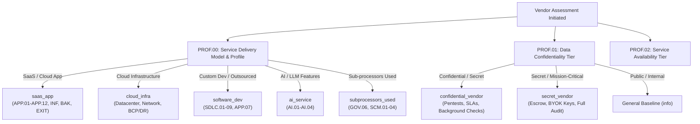
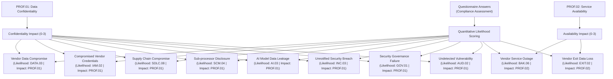

# Vendor Due Diligence (VDD) Framework Specification

## 1. Executive Summary & Overview

The [`YML/vendor-due-diligence.yaml`](vendor-due-diligence.yaml) framework provides a comprehensive, automated framework for third-party cybersecurity, operational resilience, and enterprise integration due diligence. It is structured into **12 domain categories** encompassing **80 assessable requirements** (plus 3 profiling and classification baselines).

The framework is aligned with modern international standards and regulatory mandates, including **ISO/IEC 27001:2022**, **SOC 2 Type II**, **NIS2**, **DORA**, **GDPR**, **NIST CSF 2.0**, and the **EU AI Act**.

| Domain | Focus Area | Req Count | Key Controls & Scope |
| :--- | :--- | :---: | :--- |
| **`PROF`** | Profiling & Criticality | 3 | Service delivery model, data confidentiality tier, availability SLA / MTD. |
| **`GOV`** | Governance & Personnel Security | 11 | ISO/SOC certifications, CISO designation, policies, GDPR, background checks, offboarding SLA, phishing tests. |
| **`IAM`** | Identity & Access Management | 7 | Internal MFA, privileged access reviews, non-human secrets rotation, fleet MDM & EDR. |
| **`INF`** | Infrastructure & Physical Security | 6 | Physical datacenters, DDoS & WAF edge filtering, anti-malware, log centralization, media sanitization, remediation SLAs. |
| **`SDLC`** | Development & Code Security | 9 | Secure SDLC, automated SAST/DAST/SCA, patching, env separation, SBOM (CycloneDX/SPDX), vulnerability disclosure (`security.txt`). |
| **`AUD`** | Audit & Assurance | 4 | Penetration testing reports, customer audit rights, QA testing, annual SOC 2 / ISO 27001 attestations with bridge letters. |
| **`INC`** | Incident Management | 4 | Incident response plan (IRP), 24h-72h breach notification SLA, forensic telemetry & Root Cause Analysis (RCA). |
| **`BAK`** | Continuity & Disaster Recovery | 6 | Immutable backups, restore drills, RTO/RPO metrics, documented BCP/DRP plans. |
| **`DATA`** | Data Protection & Residency | 6 | Certified data sanitization, portability, multi-tenant isolation, geographic residency, cross-border SCCs, BYOK/HYOK customer keys. |
| **`APP`** | Application Security & Identity | 12 | SSO compatibility, local MFA, encryption at rest/transit, RBAC, audit logging, session timeouts, API rate limiting, **enforced enterprise SSO usage (`APP.11`)**, and **automated IGA / SCIM access right management (`APP.12`)**. |
| **`SCM`** | Supply Chain & Sub-processors | 4 | Sub-processor registry, 30-day prior written change notice, downstream due diligence, contractual security flow-down. |
| **`AI`** | Artificial Intelligence Governance | 4 | AI disclosure, Zero-Data-Retention (ZDR) agreements, prohibition of customer data training, prompt injection guardrails. |
| **`EXIT`** | Exit Management & SLAs | 4 | 99.9%+ availability SLA & credits, non-proprietary bulk export, certified post-termination data deletion, source code escrow. |
| **Total** | **12 Domains + Profiling** | **80 Reqs** | **Comprehensive end-to-end third-party risk management.** |

---

## 2. Dynamic Implementation Groups & Scoping

The framework uses conditional implementation groups configured in `PROF.00` and `PROF.01` to tailor requirements dynamically based on vendor service characteristics:

---

## 3. Application Security & Enterprise Identity Integration (`APP`)

The `APP` domain covers application security hygiene, and specifically includes enterprise identity federation and identity governance capabilities for internal personnel using the vendor's service or extranet:

### `APP.01` to `APP.10`: Baseline Application Controls
* **`APP.01` — SSO Compatibility:** Technical capability to support Single Sign-On.
* **`APP.02` — Local MFA Support:** Native multi-factor authentication support.
* **`APP.03` — Encryption at Rest:** Strong cryptographic protection (AES-256) for stored data.
* **`APP.04` — Encryption in Transit:** Modern cryptographic protocols (TLS 1.2 / TLS 1.3) across all channels.
* **`APP.05` — Role-Based Access Control (RBAC):** Granular authorization and role definitions within the application.
* **`APP.06` — Audit Logging:** Comprehensive tracking and non-repudiation of administrative and user actions.
* **`APP.07` — Auditable Source Code:** Access to source code for custom software / outsourced development projects.
* **`APP.08` — Password Complexity:** Strong password hygiene enforcement when local credentials are used.
* **`APP.09` — Session Inactivity Lock:** Automatic termination or re-authentication after inactivity (15–30 min).
* **`APP.10` — API Rate Limiting & Protection:** Defense against abuse, credential stuffing, and scraping (OWASP API Top 10).

### `APP.11` & `APP.12`: Enterprise Operations & Identity Administration
These requirements specifically address corporate user experience and administrative operational ease:

* **`APP.11` — Enforced Enterprise SSO Usage for Client Personnel**
  * **Requirement:** The vendor extranet or service supports integration with the customer's enterprise Identity Provider (IdP) via standard protocols (SAML 2.0 or OIDC), enforcing Single Sign-On (SSO) authentication for customer personnel and eliminating unmanaged local credentials.
  * **Operational Benefit:** Internal employees use corporate credentials without separate passwords or credential reset tickets; centralized MFA applies automatically; departures immediately terminate access across all vendor extranets.
  * **Implementation Group:** `saas_app`

* **`APP.12` — Access Right and Lifecycle Management via Customer IGA Tool (SCIM / API)**
  * **Requirement:** The vendor service provides standard APIs or connectors (such as SCIM 2.0 or equivalent provisioning interfaces) allowing the customer's Identity Governance and Administration (IGA) tool to automate user provisioning, deprovisioning, and granular access right / entitlement management.
  * **Operational Benefit:** Centralizes role assignments, entitlement grants, and periodic user access recertifications (access reviews) into the corporate IGA platform (e.g., SailPoint, Saviynt, Omada, Okta IGA), removing manual administrative overhead inside vendor portals.
  * **Implementation Group:** `saas_app`

---

## 4. Automated Quantitative Risk Modeling

Assessment responses automatically drive risk scenario evaluations in CISO Assistant:

