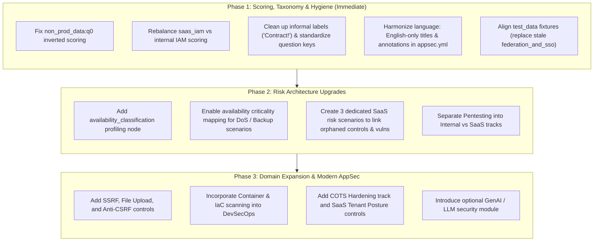

# AppSec Framework (appsec.yml) Comprehensive Improvement Plan

**Target Framework Version**: v10  
**Applicable Standard Baselines**: OWASP ASVS v4.0.3 / v5.0, OWASP Top 10 (2021/2025), ISO/IEC 27001:2022 (Annex A.8), NIST SP 800-218 (SSDF), CIS Software Supply Chain Security  
**Affected Files**:
- [YML/appsec.yml](file:///home/romain/ciso-assistant/YML/appsec.yml)
- [docs/appsec_policy_applicability_matrix.md](file:///home/romain/ciso-assistant/docs/appsec_policy_applicability_matrix.md)
- [tests/test_yaml_integrity.py](file:///home/romain/ciso-assistant/tests/test_yaml_integrity.py)
- [tests/test_application_scenarios.py](file:///home/romain/ciso-assistant/tests/test_application_scenarios.py)
- [test_data/app_appsec_*.yml](file:///home/romain/ciso-assistant/test_data/)

---

## 1. Executive Summary & Improvement Objectives

The Application Security Assessment Framework (`appsec.yml`) governs how internal engineering, infrastructure teams, and third-party SaaS vendors evaluate application risks in CISO Assistant. 

This improvement plan addresses critical structural defects, scoring anomalies, and security domain gaps:
1. **Fix Inverted & Inconsistent Scoring**: Eliminate the scoring paradox in `non_prod_data` (where having no non-production environment scores 100%) and align IAM scoring between custom apps and SaaS.
2. **Enable Multi-Dimensional Risk Criticality**: Introduce availability classification into Chapter 1 profiling and map availability/resilience scenarios to business criticality, resolving the 1D confidentiality-only blindspot.
3. **Resolve Orphaned Entities**: Connect 10 unlinked reference controls and 4 unlinked vulnerabilities to dedicated risk scenarios (specifically for SaaS tenant isolation, vendor privilege governance, and third-party assurance).
4. **Standardize Taxonomy & Localization**: Remove hardcoded French text from titles and annotations within `locale: en`, standardize question keys (`q1`, `q2`), and replace informal choice labels.
5. **Modernize AppSec Domain Coverage**: Integrate modern security controls from OWASP ASVS and NIST SSDF (SSRF, file upload hygiene, container/IaC scanning, CI/CD pipeline integrity, and customer-side SaaS posture).



---

## 2. Phase 1: Core Quality, Scoring & Taxonomy Corrections

### 1.1 Fix the Non-Production Environment Scoring Paradox (`non_prod_data`)
- **Current Defect**: `non_prod_data:0` asks *"Do you have a dedicated non-production environment?"*. Answering *"No"* awards **100 points**, allowing teams with no staging/testing environments to bypass data protection with a perfect score.
- **Refactoring**:
  ```yaml
  # Replace question 0 with a direct test-data usage question:
  urn:intuitem:risk:req_node:appsec:non_prod_data:q1:
    type: unique_choice
    text: "Are real production data records, live customer databases, or personal data utilized in non-production environments?"
    choices:
      - urn: urn:intuitem:risk:req_node:appsec:non_prod_data:q1:c1
        value: "No - Synthetic, generated, or mock test data is used exclusively"
        add_score: 100
        compute_result: true
        color: '#33a745'
      - urn: urn:intuitem:risk:req_node:appsec:non_prod_data:q1:c2
        value: "Yes - Production data is copied or utilized for testing/staging"
        add_score: 0
        compute_result: false
        color: '#fd7e14'
  ```
  - Sub-questions `q2` (masking/sanitization method: 50 pts) and `q3` (certified post-test purging: 50 pts) will depend strictly on `q1 == Yes`, preserving max node score = 100.

### 1.2 Align IAM Scoring between Custom, COTS, and SaaS
- **Current Defect**:
  - In `authentication_and_mfa`, selecting Enterprise SSO gives **100 points**.
  - In `saas_iam`, selecting Enterprise SSO gives **50 points**, requiring SCIM (`q2`) to reach 100 points. Meanwhile, choosing direct local passwords + MFA gives **100 points**, actively penalizing enterprise SSO integration.
- **Refactoring**:
  - `saas_iam:q1`: Selecting Enterprise SSO awards **100 points** (`compute_result: true`).
  - Move SCIM / automated provisioning into `saas_entitlements_and_privileges` as a dedicated IGA sub-question, matching enterprise governance standards.

### 1.3 Language Harmonization & Localization Clean-up
- **Current Defect**: File root declares `locale: en`, but nodes 37–57 contain French subtitles (e.g., `(Gestion des habilitations)`), and 18 requirement annotations are written in French (`Cadre d'évaluation...`).
- **Refactoring**:
  - Remove all French subtitles from node names.
  - Translate all French annotations in `appsec.yml` into standardized professional English.
  - (Optional future step: extract an official `YML/appsec.fr.yml` localization pack).

### 1.4 Formalize Questionnaire Choices & Standardize Keys
- **Current Defect**: Informal strings exist:
  - `data_exchange:2:choice:2`: `"Contract!"`
  - `data_destruction:2:choice:2`: `"Yes, compliant!"`
  - Inconsistent question key schemes: mix of `1`, `q1`, `question:1`, and `0`.
- **Refactoring**:
  - Rename choices to formal audit terms: `"Formal Data Transfer Agreement / DPA in place"` and `"Compliant data destruction schedule & certification operational"`.
  - Normalize all question keys to `q1`, `q2`, `q3` and choices to `c1`, `c2`, `c3`.

### 1.5 Fix Test Data Fixture Inconsistencies
- **Current Defect**: [test_data/app_appsec_vulnerable_legacy.yml](file:///home/romain/ciso-assistant/test_data/app_appsec_vulnerable_legacy.yml), `app_appsec_hybrid_saas.yml`, and `app_appsec_secure_api.yml` reference obsolete node `federation_and_sso`.
- **Refactoring**: Update fixtures to map answers cleanly to `authentication_and_mfa:q1`.

---

## 3. Phase 2: Risk Architecture Upgrades & Entity Linkage

### 2.1 Multi-Dimensional Criticality: Add Availability Profiling
- **Current Defect**: `criticality_mapping` only contains `confidentiality`. Availability is empty, skewing all operational resilience scenarios.
- **Implementation**:
  1. Add profiling node `availability_classification` to Chapter 1:
     ```yaml
     - urn: urn:intuitem:risk:req_node:appsec:availability_classification
       ref_id: availability_classification
       name: "Application Availability & Business Criticality"
       assessable: true
       depth: 2
       parent_urn: urn:intuitem:risk:req_node:appsec:info
       implementation_groups: [info]
       questions:
         urn:intuitem:risk:req_node:appsec:availability_classification:q1:
           type: unique_choice
           text: "What is the maximum tolerable downtime (MTD) / business recovery objective for this application?"
           choices:
             - urn: urn:intuitem:risk:req_node:appsec:availability_classification:q1:c1
               value: "Tier 4 - Low / Non-Critical (MTD > 72 hours; internal non-time-sensitive tools)"
               color: '#33a745'
             - urn: urn:intuitem:risk:req_node:appsec:availability_classification:q1:c2
               value: "Tier 3 - Medium / Tolerable (MTD <= 24 hours; internal business operations)"
               color: '#17a2b8'
             - urn: urn:intuitem:risk:req_node:appsec:availability_classification:q1:c3
               value: "Tier 2 - High / Sensitive (MTD <= 4 hours; customer-facing or core operational systems)"
               color: '#fd7e14'
             - urn: urn:intuitem:risk:req_node:appsec:availability_classification:q1:c4
               value: "Tier 1 - Critical / Mission-Critical (MTD < 1 hour; real-time transactional, payment, or life-safety)"
               color: '#dc3545'
     ```
  2. Populate `criticality_mapping.availability`:
     ```yaml
     criticality_mapping:
       availability:
         urn:intuitem:risk:req_node:appsec:availability_classification:q1:c1: 0
         urn:intuitem:risk:req_node:appsec:availability_classification:q1:c2: 1
         urn:intuitem:risk:req_node:appsec:availability_classification:q1:c3: 2
         urn:intuitem:risk:req_node:appsec:availability_classification:q1:c4: 3
     ```
  3. Update `test_metadata`:
     ```yaml
     test_metadata:
       availability_node_ref: availability_classification
     ```
  4. Re-target Availability Risk Scenarios:
     - `prolonged_outage_data_loss` $\rightarrow$ `impact: urn:intuitem:risk:req_node:appsec:availability_classification`
     - `api_abuse_and_denial_of_service` $\rightarrow$ `impact: urn:intuitem:risk:req_node:appsec:availability_classification`

### 2.2 Create Dedicated SaaS Risk Scenarios
- **Current Defect**: 7 SaaS reference controls and 3 SaaS vulnerabilities are orphaned and never appear in risk calculations.
- **Implementation**: Define 3 new risk scenarios in `objects.risk_scenarios`:
  1. **`saas_tenant_isolation_breach`**:
     - *Description*: Cross-tenant data leakage or unauthorized access across multi-tenant boundaries.
     - *Likelihood Node*: `saas_environment_isolation`
     - *Impact Node*: `data_classification`
     - *Vulnerability*: `weak_tenant_isolation`
     - *Controls*: `saas_tenant_isolation_and_residency`, `saas_cryptographic_sovereignty`
  2. **`saas_vendor_privilege_abuse_and_subprocessor_leakage`**:
     - *Description*: Unauthorized vendor personnel access to customer data or uncontrolled sub-processor breach.
     - *Likelihood Node*: `saas_entitlements_and_privileges`
     - *Impact Node*: `data_classification`
     - *Vulnerability*: `uncontrolled_vendor_access`
     - *Controls*: `saas_vendor_access_governance`, `saas_subprocessor_and_supply_chain`, `saas_telemetry_and_audit_export`
  3. **`saas_unverified_security_posture`**:
     - *Description*: Reliance on a vendor without independent third-party audit reports (SOC 2 Type II, ISO 27001).
     - *Likelihood Node*: `saas_audit_and_compliance`
     - *Impact Node*: `data_classification`
     - *Vulnerability*: `unverified_saas_security`
     - *Controls*: `saas_third_party_assurance`, `saas_contract`

### 2.3 Clarify Penetration Testing Track Scoping
- **Refactoring**:
  - Remove `saas_app` from node `penetration_testing_and_vulnerability_management`.
  - Reframe Question 1 strictly for self-hosted apps (Custom & COTS):
    - *Q1*: *"Is independent penetration testing conducted on the application at least annually by qualified internal or third-party testers?"* (`Yes: 50 pts`, `No: 0 pts`).
  - SaaS contractual pentesting remains cleanly managed within `saas_web_app_security:q2`.

---

## 4. Phase 3: Modern Application Security Domain Expansion

### 4.1 Server-Side Request Forgery (SSRF) & File Upload Controls
- **Target Chapters**: Chapter 3 (`app_defenses_chapter`) & Chapter 6 (`api_chapter`)
- **New Requirements**:
  - **SSRF Defense** (in `input_validation_and_injection_defense:q3`): Verify URL scheme allow-lists, internal IP range blocking (`10.0.0.0/8`, `172.16.0.0/12`, `192.168.0.0/16`, `127.0.0.1`), and cloud metadata service (`169.254.169.254`) request prevention.
  - **Secure File Uploads** (`file_upload_security` node under `custom_app`): Validate file types by magic byte inspection, enforce antivirus/malware scanning, and store uploaded files on dedicated object storage with execution flags disabled.

### 4.2 Container & Infrastructure as Code (IaC) DevSecOps
- **Target Chapter**: Chapter 5 (`sdlc_chapter`)
- **New Requirements**:
  - Extend `automated_security_testing` with `q3`: Automated container image scanning (detecting base image CVEs) and IaC scanning (detecting Terraform/K8s misconfigurations) integrated into CI/CD.

### 4.3 Software Supply Chain & CI/CD Pipeline Integrity
- **Target Chapter**: Chapter 5 (`sdlc_chapter`)
- **New Requirements**:
  - Extend `code_review_and_ci_cd_integrity`: Enforce commit signing, branch protection with mandatory approval bypass prevention, and isolated pipeline secrets (e.g. OIDC workload identity federation replacing long-lived static build tokens).

### 4.4 COTS Software Hardening Track
- **Target Group**: `cots_app`
- **New Requirement Node**: `cots_deployment_hardening`
  - Questions covering: removal of default vendor passwords, adherence to vendor/CIS security benchmarks, and formal vendor patch deployment SLAs (Critical patches applied <= 14 days).

### 4.5 SaaS Customer-Side Tenant Posture Checks
- **Target Chapter**: Chapter 10 (`saas_chapter`)
- **Enhancement**: Supplement contractual questions with customer-side tenant configuration verification:
  - Disabling anonymous / public document sharing by default.
  - Enforcing tenant session timeout policies (<= 15 minutes of inactivity).
  - Actively exporting tenant audit logs via API/webhook into the enterprise SIEM.

---

## 5. Verification, Test Strategy & Migration Matrix

| Component | Current State (v7) | Target State (v8) | Test Validation Method |
| :--- | :--- | :--- | :--- |
| **Framework Version** | `7` | `8` | Assert `version >= 8` in `test_yaml_integrity.py` |
| **Requirement Nodes** | 58 | 60 (+1 Availability, +1 COTS Hardening) | `expected_requirement_nodes_count: 60` |
| **Reference Controls** | 26 | 28 (+1 SSRF/Upload, +1 COTS Hardening) | `expected_reference_controls_count: 28` |
| **Risk Scenarios** | 16 | 19 (+3 SaaS Scenarios) | `expected_risk_scenarios_count: 19` |
| **Vulnerabilities** | 18 | 18 (all 18 linked to scenarios) | Assert 0 orphaned vulnerabilities in tests |
| **Availability Ref** | `null` | `availability_classification` | Verified in `test_application_scenarios.py` |
| **Unit Test Suite** | 211 passing tests | >= 215 passing tests | Run `python3 -m unittest discover tests` |

---

## 6. Recommended Execution Order

1. **Step 1**: Update `test_data/app_appsec_*.yml` fixtures to eliminate obsolete `federation_and_sso` keys.
2. **Step 2**: Apply Phase 1 scoring and localization fixes to [YML/appsec.yml](file:///home/romain/ciso-assistant/YML/appsec.yml).
3. **Step 3**: Introduce `availability_classification`, update `criticality_mapping`, and add the 3 SaaS risk scenarios in [YML/appsec.yml](file:///home/romain/ciso-assistant/YML/appsec.yml).
4. **Step 4**: Update [docs/appsec_policy_applicability_matrix.md](file:///home/romain/ciso-assistant/docs/appsec_policy_applicability_matrix.md) to document the new availability dimension and SaaS scenarios.
5. **Step 5**: Update test assertions in [tests/test_yaml_integrity.py](file:///home/romain/ciso-assistant/tests/test_yaml_integrity.py) and verify complete test suite pass.
